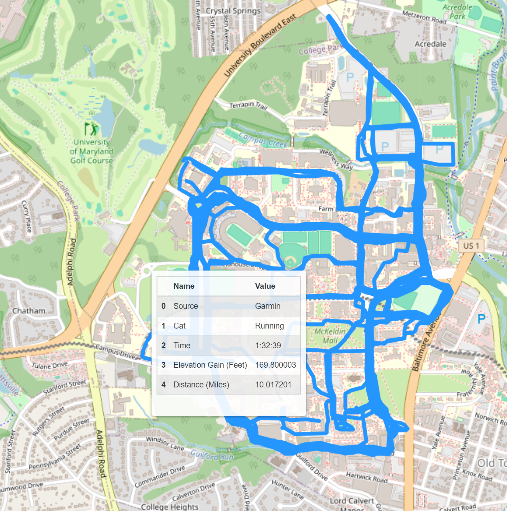

# Workout Map

This project's goal is to take a user's GPX and/or TCX files from a tracked workout and display them all on the same map. The goal is to be able to visualize all of the different places where a person has completed a workout or activity such as a run, walk, or bike ride. Written in Python this project utilizes different libraries and custom file parsers to extract critical information from the GPX/TCX files and display them on a map of the world.

# Example Output

This image shows an example output that would be generated from this program. This image shows some of the runs that I completed during my time at The University of Maryland. My cursor is hovering over one of the routes I ran, a 10-mile run. It showcases the stats of the run and if the route was clicked on a bounding box would appear around the route to show where it went. This image shows a handful of runs, and thus moving the cursor to another location may show a different workout such a 3 or 5 mile route that I completed.    

# How it Works

When using this project it is critical that you have access to the GPX/TCX files of the workouts that you wish to display. This project expects GPX or TCX files to exist in a subdirectory named 'Workouts'. In my personal rendition of this program, my workouts structured in to two sections, ./Workouts/MapMyWalkTCX and ./Workouts/GarminGPX

FileParsers.py contains the GPX and TCX parsers, as well as the GarminWorkout class. These are the main functions of the program. A GPX/TCX file will be parsed using the proper parsing function, and then the GarminWorkout object is created. 

WorkoutMap.py will iterate through the desired directories, and create the map of the GarminWorkout Objects. This is the file that needs to be altered for your specific use case. The current structure is how I am personally using it to display my activities.

# Current Functionalities
Currently, the program is able to display the workouts in different colors based on the category defined in the TCX/GPX File. There are 9 categories supported:
 - Run
 - Walk
 - Bike
 - Hike
 - Golf
 - Kayaking
 - Swimming
 - Other
 - Multi Sport

 In addition, when the map is generated, by hovering over the activity a pop up will appear displaying different stats about the workout. These stats include:
 - The Source of the Workout
 - The Category
 - Duration
 - Distance
 - Elevation Gained

Another feature incorperated is the ability to toggle on/off the different categories of workout. There is a layers box in the top right of the map which contains checkboxes, if checked then the map is displaying that category of workout, if not then the map will not be displaying it. 
